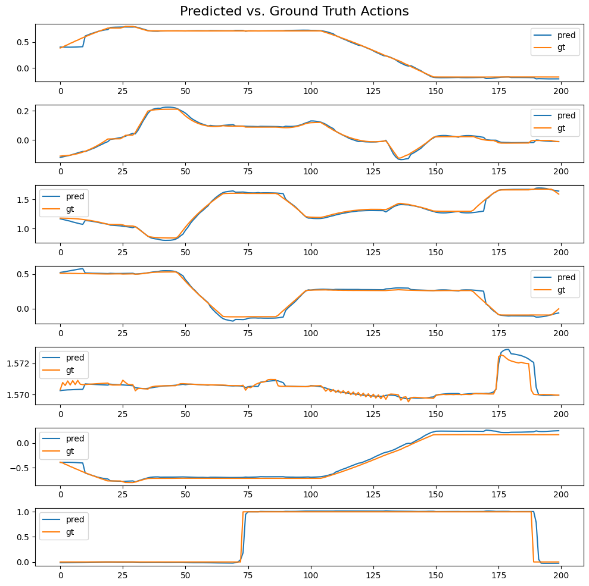
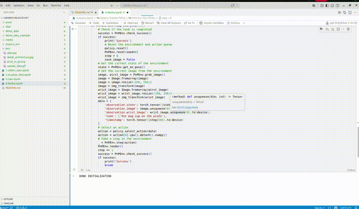
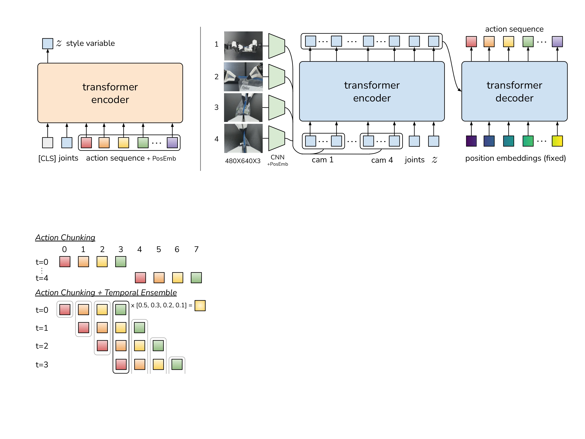

# Training ACT with LeRobot in MuJoCo

## Table of Contents
- [Setup](#setup)
- [1. Collect Demonstration Data](#1-collect-demonstration-data)
- [2. Playback Your Data](#2-playback-your-data)
- [3. Train Action Chunking Transformer (ACT)](#3-train-action-chunking-transformer-act)
- [📚 Theory](#-theory)
  - [➡️ ACT — Action Chunking with Transformers](#️-act--action-chunking-with-transformers)
    - [1. Action Chunking](#1-action-chunking)
    - [2. CVAE](#2-cvae)
    - [3. Temporal Ensembling](#3-temporal-ensembling)
    - [Reference](#reference)

## Setup
```bash
conda create -n py310 python=3.10
conda activate py310
```
```bash
git clone git@github.com:Gege4526/LeRobot-MuJoCo-ACT.git
cd ~/LeRobot-MuJoCo-ACT
pip install -r requirements.txt
conda install jupyterlab
pip install ipywidgets ipykernel
python -m ipykernel install --user --name py310 --display-name "py310"
code .
```
```bash
cd asset/objaverse
unzip plate_11.zip
```
## 1. Collect Demonstration Data

Run the `1.collect_data.ipynb` notebook to collect demonstration data in the provided environment.

<p align="center">
  
</p>


The task is to **pick up the cup and place it onto the plate**. The environment considers the task successful when:

* The cup is placed on the plate.
* The gripper is open.
* The end-effector is positioned above the cup.

### 🎮 Keyboard Controls

* `W/A/S/D`: Move along the **x-y plane**
* `R/F`: Move along the **z-axis**
* `Q/E`: Tilt the end-effector
* `Arrow Keys`: Rotate the end-effector
* `Space`: Toggle the gripper state
* `Z`: Reset the environment and discard the cached data from the current episode

### 🖥️ Observation Views

The rendered observation contains four views:

* **Top-right:** Agent view
* **Bottom-right:** First-person wrist camera view
* **Top-left:** Side view
* **Bottom-left:** Top-down view

### Data Structure
```bash
fps = 20,
features={
    "observation.image": {
        "dtype": "image",
        "shape": (256, 256, 3),
        "names": ["height", "width", "channels"],
    },
    "observation.wrist_image": {
        "dtype": "image",
        "shape": (256, 256, 3),
        "names": ["height", "width", "channel"],
    },
    "observation.state": {
        "dtype": "float32",
        "shape": (6,),
        "names": ["state"], # x, y, z, roll, pitch, yaw
    },
    "action": {
        "dtype": "float32",
        "shape": (7,),
        "names": ["action"], # 6 个关节角 + 1 个夹爪
    },
    "obj_init": {
        "dtype": "float32",
        "shape": (6,),
        "names": ["obj_init"], # 仅物体初始位置，训练中不使用
    },
},
```

## 2. Playback Your Data

Run `2.visualize_data.ipynb` to replay and inspect the collected demonstration data.

The main MuJoCo window reconstructs the simulation scene and replays the recorded robot actions.

The overlaid images show the observations stored in the dataset:

* **Top-right:** Agent-view image from the dataset
* **Bottom-right:** Wrist-camera image from the dataset

This allows you to verify that the recorded actions and visual observations are correctly synchronized.

## 3. Train Action Chunking Transformer (ACT)

Run `3.train.ipynb` to train an **Action Chunking Transformer (ACT)** on the collected demonstration dataset.

Training takes approximately **30–60 minutes**, depending on your hardware and dataset size.

In this example, ACT is trained with:```chunk_size = 10```

The trained checkpoint will be saved to:```./ckpt/act_y```

## 4. Deploy your Policy

Run `4.deploy.ipynb`

<p align="center">
  
</p>

<p align="center">
  
</p>


## 📚 Theory
### ➡️ ACT — Action Chunking with Transformers

**ACT (Action Chunking with Transformers)** is an **imitation learning** method designed for robotic manipulation tasks.

#### 1. Action Chunking

ACT predicts a **chunk of (k) future actions** instead of predicting only one action at a time.

$$
A_t=[a_t,a_{t+1},...,a_{t+k-1}]
$$

#### 2. CVAE

ACT uses a **Conditional Variational Autoencoder (CVAE)** to model variations in expert demonstrations.

During training, the expert action sequence is encoded into a **latent variable (z)**, which captures different possible action styles or behaviors.

$$
\text{Demonstration} \rightarrow \text{Encoder} \rightarrow z
$$

The Transformer then predicts the action chunk conditioned on the observation and (z):

$$
(\text{Observation},z) \rightarrow \text{Action Chunk}
$$

This helps reduce **behavior averaging** when multiple valid actions exist for the same observation.

> [!IMPORTANT]
> **CVAE** → models variations in expert demonstrations and helps handle multimodal actions.

#### 3. Temporal Ensembling

For each timestep, the same action can be predicted multiple times from overlapping action chunks.

These predictions are combined using a **weighted average**, with more recent predictions receiving higher weights.

<p align="center">
  
</p>

> [!NOTE]
> **Training:**  
> Expert Actions → CVAE Encoder → $z$  
> Image Features (CNN) + Joint State + $z$ → Transformer → Action Chunk
>
> **Inference:**  
> Image Features (CNN) + Joint State + $z=0$ → Transformer → Action Chunk

<p align="center">
  
</p>

#### Reference
**Paper**
https://arxiv.org/abs/2304.13705

Repo from [Every-Embodied](https://github.com/datawhalechina/every-embodied/tree/main/06-%E7%AD%96%E7%95%A5%E6%8A%93%E5%8F%96%E6%88%96%E6%8A%93%E5%8F%96VLA/%E5%A4%A7%E6%A8%A1%E5%9E%8B%E6%8E%A7%E5%88%B6%E3%80%81VLA%E3%80%81VLM/04mujoco%E5%A4%8D%E7%8E%B0ACT%E3%80%81Pi0%E3%80%81SmolVLA)


