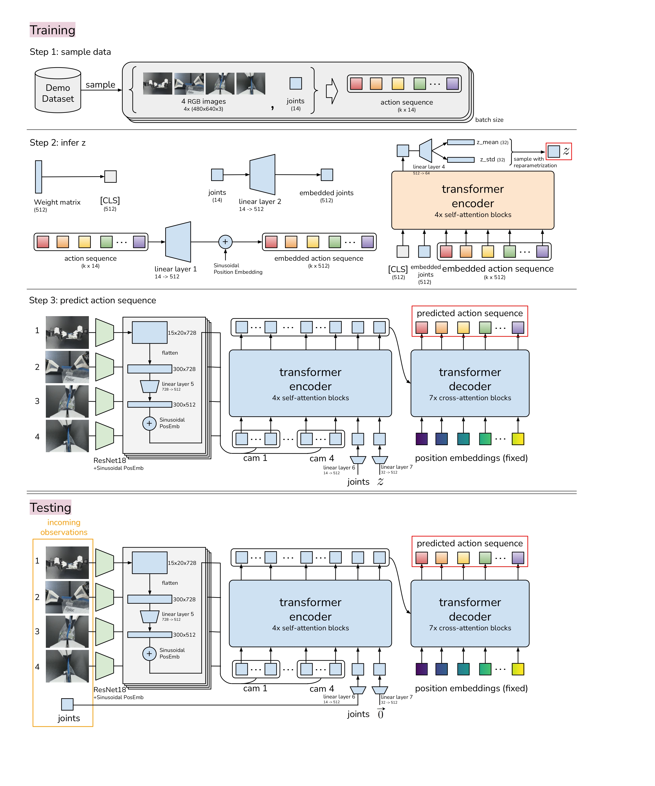
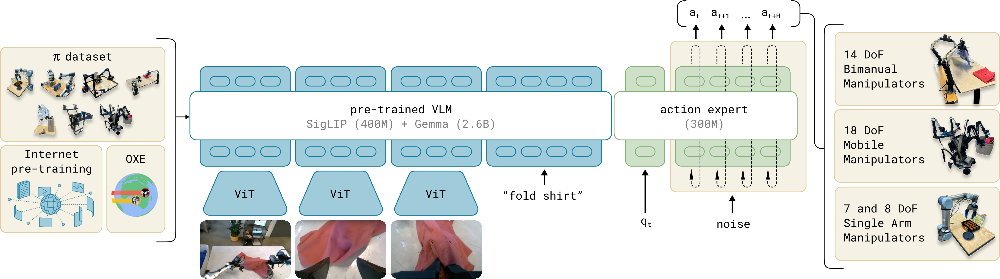
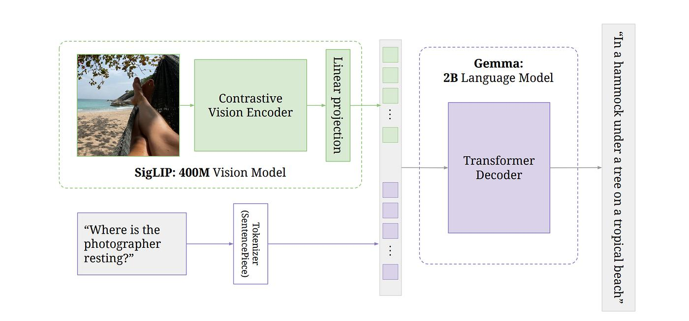

# Training ACT, SmolVLA, and Pi0 with LeRobot in MuJoCo
## 🤖 ACT — Action Chunking with Transformers

**ACT (Action Chunking with Transformers)** is an **imitation learning** method designed for robotic manipulation tasks.

### 1. Action Chunking

ACT predicts a **chunk of (k) future actions** instead of predicting only one action at a time.

$$
A_t=[a_t,a_{t+1},...,a_{t+k-1}]
$$

### 2. CVAE

ACT uses a **Conditional Variational Autoencoder (CVAE)** to model variations in expert demonstrations.

During training, the expert action sequence is encoded into a **latent variable (z)**, which captures different possible action styles or behaviors.

$$
\text{Demonstration} \rightarrow \text{Encoder} \rightarrow z
$$

The Transformer then predicts the action chunk conditioned on the observation and (z):

$$
(\text{Observation},z) \rightarrow \text{Action Chunk}
$$

This helps reduce **behavior averaging** when multiple valid actions exist for the same observation.

> [!IMPORTANT]
> **CVAE** → models variations in expert demonstrations and helps handle multimodal actions.

### 3. Temporal Ensembling

For each timestep, the same action can be predicted multiple times from overlapping action chunks.

These predictions are combined using a **weighted average**, with more recent predictions receiving higher weights.

> [!NOTE]
> **Action Chunking** → predicts multiple future actions at once
> 
> **CVAE** → models different possible expert behaviors
> 
> **Temporal Ensembling** → combines overlapping action predictions for smoother control

  

  

### Reference
**Paper**
https://arxiv.org/abs/2304.13705

## 🤖 π₀ 

**π₀** is a **VLA** model developed by Physical Intelligence for general-purpose robot control.

Unlike ACT, which directly predicts action chunks, π₀ combines a pretrained **VLM** with a specialized **action expert** to generate continuous robot actions.

  

### 1. Pre-trained VLM
π₀ builds its VLM backbone on **PaliGemma**, which consists of:

* **SigLIP**: A **ViT (Vision Transformer)** used as the vision encoder. It converts input images into image tokens. A **linear projection layer** then maps these image tokens to the same embedding dimension as the Gemma text tokens, allowing them to be processed together.

* **Gemma**: A **decoder-only Transformer** used as the language-model backbone. It jointly processes the projected image tokens and text tokens to produce contextual visual-language representations.

> [!NOTE]
> **SigLIP**
> Image → Image Tokens
> 
> **Gemma**
> Image Tokens + Text Tokens → Contextual Representations

  

> [!IMPORTANT]
> π₀ extends **PaliGemma** with three main modifications:
>
> 1. **Robot State & Action Projection** – maps continuous robot states and actions into Transformer representations.
> 2. **Flow-Matching Time Embedding** – encodes the flow timestep $\tau$ using an additional MLP.
> 3. **Action Expert** – a smaller Transformer specialized for continuous robot action generation.

### 2. Action Expert
conditional flow matching
action chunk

### Reference
**Paper**
https://arxiv.org/abs/2410.24164

**Blog**
https://www.pi.website/blog/pi0

## 🤖 SmolVLA

### Reference
**Paper**https://arxiv.org/abs/2506.01844

**Blog**
https://huggingface.co/blog/smolvla

